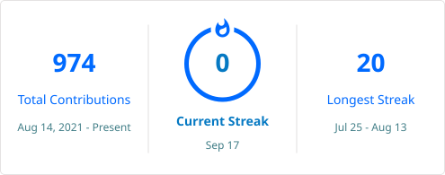

<h2 align="center">Hi there 👋</h2>

  

---

<h2 align="center">My GitHub Stats 🚀</h2>

<table align="center" border="0" cellspacing="0" cellpadding="0" style="border-collapse: collapse; border: none;">
  <tr>
    <td>
      
    </td>
    <td>
      
    </td>
  </tr>
  <tr>
    <td colspan="2" align="center">
      
    </td>
  </tr>
</table>

  

 
---

<h2 align="center">My Contribution Graph 🐍</h2

     

<!--

-->

<!--
Here are some ideas to get you started:

- 🔭 I’m currently working on ...
- 🌱 I’m currently learning ...
- 👯 I’m looking to collaborate on ...
- 🤔 I’m looking for help with ...
- 💬 Ask me about ...
- 📫 How to reach me: ...
- 😄 Pronouns: ...
- ⚡ Fun fact: ...
-->
